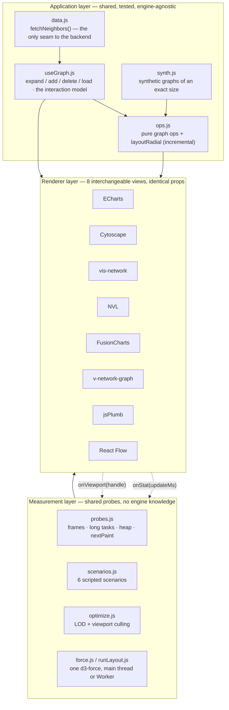

# RFC: Frontend graph rendering engine for the identity graph walker

| | |
|---|---|
| **Status** | Draft — for review at #design-huddle |
| **Owner** | Ansh Singh |
| **Type** | HLD / library-selection RFC |
| **Slack** | `#design-huddle` — this doc posted ≥48h before the session |
| **Tracker** | [Design huddle tracker](https://docs.google.com/spreadsheets/d/1L7r0TazwOmFooBt3QDmat4K0qUAkNqKk81MoWigjBt8/edit?gid=0#gid=0) |
| **Repo** | `poc-graph-expansion` |
| **Decision requested** | Approve a shortlist of 2 engines to take into production, and approve the shared-layer architecture below |
| **Reading time** | 15 min doc, 10 min if you only read §1, §5 and §7 |

> **§5 carries two measured passes.** Pass 1 was 7 scenarios × 8 engines at
> **1,000 / 1,500**, plus the Worker leg. **Pass 2 closed every gap pass 1 left**:
> the size sweep to **50,000 nodes** (§5.1), both paint backends on the three
> engines that have two (§5.5), **expansion** at 1k/5k/20k (§5.7), the LOD-off
> baseline (§5.5), and the leak column three times over with `--expose-gc` (§5.3).
> Raw rows: [`bench-data/`](bench-data/). **Rendered, with every table:
> [RFC.html](RFC.html).**
>
> **D1 is now answered.** NVL on WebGL is the only engine measured that is usable
> above ~10,000 nodes — 480 ms at 20,000 and 1,196 ms at 50,000, against 4.3 s and
> "unresponsive past two minutes" for Cytoscape.
>
> **Pass 2 also retracted four things pass 1 asserted**, and every one was caught
> by *repeating a measurement*, not by re-reading code: the `leakMB` column was a
> sign error rather than GC noise; ECharts does not absorb the full feed; NVL's
> WebGL zoom "win" is inside its own noise; and the six `unsupported` hover rows
> were a calibration grid stepping over 11-pixel nodes. §5.0 tabulates the
> run-to-run spread that exposed them — **read it before quoting any single
> number.**
>
> The one gap pass 2 opened rather than closed: §5.7 shows the interaction this app
> ships is capped by **our own props contract**, not by any library.

---

## 1. Problem statement

An analyst investigating an identity starts from **one** node — a phone, an
email, a device, a document — and walks outward: *what else is this linked to,
and what is that linked to.* The graph is not fetched whole and it is not
static. It grows under the analyst's cursor, one expansion at a time, and the
interesting cases are exactly the ones where it grows fast: a device shared by
four hundred accounts, a cluster that keeps unfolding four levels deep.

That shape of interaction breaks the assumption almost every graph-library demo
is built on. Demos load a fixed graph once, look good, and stop. Ours has to
survive:

1. **A cold load of a dense result set** — the analyst pastes in a cohort, not a
   single node.
2. **Incremental expansion into an already-large scene** — 25 new nodes arriving
   into a graph of 20,000 is a *diff*, and diffing is where these libraries
   differ most once a graph is being explored rather than loaded.
3. **Continuous interaction** — pan, zoom, hover-to-peek — at a frame rate that
   does not make the analyst feel the tool is fighting them.
4. **A hard host constraint: React 16.14.** This is not negotiable in this round,
   and it eliminates library options outright (§7.4).

### What we actually need to decide

Not "which graph library is best" — that question has no answer. Three
decisions, in this order:

| # | Decision | Why it comes first |
|---|---|---|
| **D1** | Where is our **breaking point**, per candidate? | The single most useful number this exercise produces. Everything else is a tiebreak. |
| **D2** | Does the **rendering architecture** (shared layer + swappable renderer) hold? | If yes, D3 is reversible and low-stakes. If no, D3 is a one-way door. |
| **D3** | Which **two** engines go to a production spike? | Two, not one — the customisation half of the comparison (§6.3) can only be settled by building our real node design. |

### Why this needed a POC rather than a spreadsheet

Every one of these libraries advertises "handles large graphs". None of them
publishes the number at which it stops, and none of them measures the case we
care about (expansion into a large scene) at all. The claims are not
comparable because no two vendors measure the same thing on the same data.

So the POC's actual product is **not a pretty graph**. It is a rig that renders
the *same graph at the same coordinates through eight libraries* and reports the
same eight numbers for each, so that the comparison is between renderers and
nothing else.

---

## 2. Scope

**In scope**

- Rendering engine selection for the identity graph view.
- The client-side architecture that isolates that choice.
- A reproducible measurement harness, and the numbers it produces.

**Explicitly out of scope for this RFC** *(named because a benchmark's blind
spots decide more than its findings)*

| Not covered | Why | Where it goes |
|---|---|---|
| Backend graph store / Cypher query shape | Independent of the renderer; `fetchNeighbors()` is the single seam | Separate RFC |
| Each library's own **layout engine** | Deliberately excluded — see §3.2 | Never; it would make this a layout comparison |
| Each library's own culling / LOD | Same reason | §6.4 discusses the caveat |
| Custom glyphs and edge routing, **benchmarked** | Capability matrix only so far — an unmeasured column is more honest than a guessed one | §5.5, next pass |
| Accessibility, touch, mobile GPUs | Nothing here has been near a phone | Follow-up, must not be forgotten |
| API ergonomics / maintenance load | Only prose notes exist (`src/engines.js`) | The production spike (D3) |

---

## 3. Proposed architecture

### 3.1 One shared layer, many dumb renderers



The load-bearing claim: **every renderer is a dumb view over `useGraph` and
takes identical props.** Swapping engines is changing one lazy import. That is
the property that makes D3 reversible, and it is what §6.3 is really reviewing.

Two callbacks flow back the other way and they are the entire engine-specific
surface:

- `onStat(updateMs)` — every renderer times its own update and self-reports.
- `onViewport(handle)` — `{ zoomBy, panBy, fit }`, or `null` if the library has
  no viewport. **Publishing `null` is itself a finding** (§5.4).

### 3.2 The decision that makes the numbers mean anything

> Every pane is handed **the same graph at the same coordinates**, from one
> shared `layoutRadial` — not from each library's own layout engine.

Several of these ship perfectly good layouts and a real app would use them.
Using them here would make the comparison about *layouts* rather than
*renderers*: eight different solvers, eight sets of constants, eight stopping
rules. Timing those against each other measures eight unrelated
implementations, not the question being asked.

The same reasoning applies to LOD and culling (both done in shared code) and to
the force solver (one d3-force simulation for everyone).

**The honest counterweight, which belongs in any write-up:** an engine that
ships its own culling gets no extra credit here, and an engine with none gets
to borrow ours. That is deliberate — it separates *"this library is fast"* from
*"this library ships the optimisation you would otherwise have written"*. Both
matter; they are different questions and they get answered separately (§5.5).

### 3.3 How the graph is actually built

Worth stating because it is the first question every reviewer asks about a
synthetic benchmark: *what does "50,000 nodes" mean here?*

`synthGraph(nodes, edges)` lays a **spanning tree** over the node count first,
then adds cross-links until it reaches the edge count. Two consequences:

- **The edge count is a target with a floor of `nodes − 1`.** A tree of *n*
  nodes is *n − 1* edges, and the tree is not optional: `layoutRadial` places a
  node inside its parent's angular wedge, and a node with no path to a root has
  no wedge. 5,000 nodes never has fewer than 4,999 edges however low the dial
  goes.
- **It is also a ceiling in practice.** Duplicate pairs are skipped rather than
  retried, so asking for far more edges than the node count can support lands
  short — 100 nodes asked for 100,000 edges builds 2,699.

Every scenario therefore reports `graph.edges.length`, **never the knob**, and
the UI prints the overshoot next to the counts rather than silently disagreeing
with the dial. Every size dial bottoms out at 0: an empty pane is a
measurement — what this engine costs holding nothing — and it is the baseline
the other rows are differences from.

---

## 4. The candidates

Graph libraries fall into three rendering families, and **the family predicts
more about the answer than the library does**:

| Family | How it draws | Customisation | Scale |
|---|---|---|---|
| **SVG** | one DOM element per node and per edge | highest — it's CSS and the DOM | poor; the element count *is* the cost |
| **Canvas** | pixels into one `<canvas>`, redrawn per frame | moderate — you draw it yourself | good, medium-to-large |
| **WebGL** | pixels via the GPU, geometry uploaded once | hardest — shaders and instancing | built for massive |

Eight engines, all implemented against identical props:

| Engine | Package | Surface | Viewport API | Built-in LOD | Edge routing |
|---|---|---|---|---|---|
| Apache ECharts | `echarts` 6.1 | canvas **/ SVG** | `roam` · `graphRoam` | none | straight, curved |
| Cytoscape.js | `cytoscape` 3.34 | canvas **/ WebGL** | `zoom()` / `panBy()` native | `min-zoomed-font-size` (auto) | bezier, taxi, segments, haystack, loop |
| vis-network | `vis-network` 10.1 | canvas | `moveTo()` / `getScale()` native | `scaling.label.drawThreshold` | dynamic, continuous, cubicBezier, curvedCW |
| Neo4j NVL | `@neo4j-nvl/base` 1.2 | canvas **/ WebGL** | `setZoom()` / `setPan()` native | automatic caption dropping | straight, native loops |
| FusionCharts | `fusioncharts` 4.2 | SVG | **none** | none | straight only |
| v-network-graph | `v-network-graph` 0.9 | SVG (**Vue 3**) | `svg-pan-zoom` | none | straight, curved, selfLoop |
| jsPlumb | `@jsplumb/browser-ui` 6.2 | HTML + SVG | **hand-built, ~20 lines of CSS transform** | none | Bezier, Flowchart, StateMachine, Straight |
| React Flow | `react-flow-renderer` 9.7 | DOM + SVG | `useZoomPanHelper` | write it yourself | bezier, step, smoothstep, straight, custom |

Three of the eight can draw the identical scene through **more than one
backend** (ECharts canvas/SVG, Cytoscape canvas/WebGL, NVL canvas/WebGL). That
is the cleanest test of the SVG/canvas/WebGL framing above, because it is the
only place where the family changes and the library, the data and the layout do
not.

---

## 5. Results — first pass measured, ⚠️ single run

**Every scenario ran at 1,000 nodes / 1,500 edges**, across all eight engines —
48 cells, plus 8 more for the Worker leg of §5.6, in 6.7 minutes. One graph size
for the whole matrix is deliberate: it means the differences between these rows
are the engine and the scenario, and nothing else. Finding each library's
ceiling is a separate pass and is still open (§5.1).

> **⚠️ Read §5.0 before quoting anything below.** This is **one run, not the
> median of three**, on a **120 Hz display**, driven by an **automated browser**.
> Four specific rows are artefacts rather than findings and are marked in place.
> The ms columns are trustworthy; the fps columns are ceiling-bound.

### 5.0 What produced these tables, and what is wrong with them

<!-- RESULTS:BEGIN — grep this marker to find the POC output -->

**Producer:** raw rows are in **`graph-bench-results.json`** at repo root (56
rows). Reproduce by hand with `npm run dev` → `#/bench` → **Everything** →
`#/compare` → **Export JSON**. This pass was driven with a Playwright script
against `npm run preview` (a production build) so the whole matrix ran
unattended; the script clicks the same button a human would and reads the same
`localStorage` rows.

**Protocol that makes the numbers defensible** (all six steps, or the table is
decoration):

1. **Chromium.** Long-task and heap columns exist nowhere else, and `—` in half
   the table is a bad look in a review.
2. **Mains power, not battery.** Throttled cores can halve frame rates.
3. **All engines**, sequentially. Results are written to `localStorage` per row
   as each lands, so a crash costs one row, not the run.
4. **Three runs. Report the median. Say that you did.**
5. Export JSON for the raw rows.
6. Publish with the environment stated (block below).

Of those six steps **this pass satisfies four**. Steps 4 and 6 are where it is
short, and that is stated in the block below rather than buried.

**Environment block — must accompany every number:**

| | |
|---|---|
| Browser | Chrome for Testing (Playwright build 1234), production `vite preview` build |
| Long-task / heap columns available | ✅ yes — Chromium, with `--enable-precise-memory-info` |
| Display refresh rate | **120 Hz** ⚠️ — `dropped` assumes a 60 Hz budget, so it **over-counts**, and `fps` cannot exceed 120 |
| CPU / machine | Apple silicon (arm64), macOS 25.6 |
| On battery? | not controlled for ⚠️ |
| Runs, and median or single | **one run per cell** ⚠️, except the leak column (3 runs) and the 11 configurations measured in both passes |
| `--js-flags="--expose-gc"` | ✅ set for pass 2 — `window.gc` confirmed present at launch |
| Window focus | automated; rAF throttling suppressed by flag, not by focus ⚠️ |
| Paint backend | ✅ both backends measured for all three engines that have two (§5.5) |
| Sizes | ✅ 1,000 · 5,000 · 20,000 · 50,000 (§5.1) |

#### What one run is actually worth — read this before quoting any number

Pass 2 re-ran **eleven configurations** pass 1 had already measured at the identical
engine, size and default backend. Those pairs are the only variance estimate this
exercise has:

| Engine | Scenario | Metric | pass 1 | pass 2 | spread |
|---|---|---|---|---|---|
| Cytoscape | streaming | `frameP95` | 33.3 | 33.3 | **0%** |
| NVL | streaming | `frameP95` | 16.7 | 16.6 | **−1%** |
| Cytoscape | zoom & pan | `frameP95` | 9.3 | 9.0 | **−3%** |
| NVL | hairball | `ttfrMs` | 129 | 113 | −12% |
| Cytoscape | hairball | `ttfrMs` | 260 | 220 | −15% |
| ECharts | hairball | `ttfrMs` | 238 | 181 | −24% |
| ECharts | streaming | `pushedPerSec` | 500 | **365** | **−27%** |
| ECharts | zoom & pan | `frameP95` | 17.6 | **25.2** | **+43%** |
| ECharts | streaming | `frameP95` | 83.5 | **124.2** | **+49%** |
| **NVL** | zoom & pan | `frameP95` | 9.2 | **17.7** | **+92%** |

**The pattern is not random and it is the most useful thing in §5.** Where an
engine is comfortable the number repeats to within a few percent; where it is
**near its limit** the same measurement swings by half — every one of the four
worst spreads is ECharts or NVL on a scenario already marginal for it.
**Variance is itself a signal of headroom.**

**One conclusion this retracts.** §5.5 shows NVL's zoom improving from 17.7 ms on
canvas to 9.2 on WebGL — and that difference is *indistinguishable from noise*,
since identical canvas configurations produced both numbers. It is written up as
unresolved. NVL's *streaming* improvement survives the same test.

`ttfrMs` moved −12% to −24% and all in the same direction, which looks like a
warmer machine rather than per-engine noise: **treat cold-load rankings as ordinal.**

**The four rows that are artefacts, not findings.** Stated here because each one
otherwise reads as a result:

1. **v-network-graph drew nothing.** `VngGraph.jsx` hard-caps at `CEILING = 150`
   nodes and renders a refusal notice above it — measured in the earlier round at
   ~8 s for 200 nodes and a locked tab at 500. So at 1,000 nodes **every
   v-network-graph cell in this section is the cost of an empty pane showing a
   message**: `updateMs 0`, 1.46 MB of heap, a flat 120 fps. It is not the
   fastest engine here; it is the one that declined to run. Its `ttfrMs` of 11 ms
   is the refusal being painted.
2. **The negative `leakMB` values were a bug in the metric, and this list
   previously got it wrong.** It called them "collection events, not memory
   returned". They were not. `leakMB` read its baseline *with the base graph
   already on screen* and compared it against a reading taken after the pane had
   been emptied — so every engine that retained nothing scored its own base graph
   as a negative leak. NVL came back at **−72 MB**, about what NVL costs to hold
   1,000 nodes. Re-running with `--expose-gc` reproduced it **exactly**: that is
   what a sign error does and what GC noise does not. **Fixed** — see §5.3.
   Negative `heapMB` *during churn* is still a collection landing mid-window; that
   column was never the broken one.
3. **The six `unsupported` hover rows were this harness's bug, now found.** The
   calibration grid was fixed at 56 × 28 — one sample every 28 × 15 px, hunting for
   nodes about **11 px** across. It stepped over them. At 4 px spacing **five of
   the six report hover** (§5.4). **The claim that six libraries do not report
   node hover is withdrawn.** A geometry hypothesis was tested and falsified along
   the way — the pane is fully in the viewport and all 1,568 points resolved to a
   real element — which was true and simply not the cause.
4. **`fps` is pinned at the refresh rate almost everywhere.** A `frameP95` of
   8.3–9.4 ms *is* a clean 120 Hz frame. Rows reading 120 fps are not "faster
   than 60 fps engines" — they are all simply keeping up, and `frameP95` is where
   they separate. This is exactly the trap `METRICS.md` warns about.

**One scope limit, easy to miss:** `#/bench` mounts each engine at
`renderers[0]`, its **default** paint backend. So every number below is ECharts
**canvas**, Cytoscape **canvas** and NVL **canvas** — **no SVG or WebGL variant
was measured.** Swapping backends is a lab-only control (§5.5), and since three
of the eight have two backends each, that is three unmeasured configurations
sitting behind the results.

**Three rules for reading anything below** — these are not caveats, they are the
difference between a finding and a misquote:

1. **`—` is not zero.** Where the browser will not report, the probe returns
   `null`. A printed `0 ms blocked` would read as "never blocked", which is a
   far worse lie than "not measured here".
2. **Never quote a speed-up without its denominator.** "Culling made it three
   times faster" is not a finding. "…while dropping 71% of the nodes" is.
3. **A mean hides the failure you can see.** 16.8 ms average is a steady 60 fps
   *and* 56 clean frames plus four 90 ms stalls. That is why every frame figure
   here is a percentile and **`p95` is the headline, not `fps`**.

### 5.1 The breaking point — ✅ MEASURED, and it answers D1

*Hairball at 1,000 → 5,000 → 20,000 → 50,000, edges at 1.5× nodes, cold pane each
time. `ttfrMs` to first visible render.*

| Engine | 1,000 | 5,000 | 20,000 | 50,000 | longest single task @20k | heap @20k |
|---|---|---|---|---|---|---|
| **NVL · WebGL** | — | **203** | **480** | **1,196** | 466 ms | — |
| NVL · canvas | 152 | 312 | 1,028 | 2,452 | **489 ms** | **103 MB** |
| vis-network | **136** | 541 | 2,170 | 5,630 | 1,272 ms | 131 MB |
| Cytoscape · canvas | 237 | 873 | 4,266 | **>120 s, unresponsive** | 3,479 ms | 319 MB |
| Cytoscape · WebGL | — | 1,039 | 3,948 | 10,813 | 3,936 ms | — |
| ECharts · canvas | 189 | 662 | 4,183 | — | 4,082 ms | **503 MB** |
| React Flow | 353 | **10,843** | **killed the renderer process** | — | 10,819 ms @5k | 136 MB @5k |
| **v-network-graph** | hard cap at **~150** in `VngGraph.jsx` — refuses to draw | | | | | **out** |
| jsPlumb | **6,594** | not attempted — its wall is at or below 1,000 | | | 3,928 ms @1k | **out** |
| FusionCharts | not swept — no viewport, absorbed 103/500 (§5.3) | | | | | **out** |

**The column that decides this is the longest single task, not `ttfrMs`.** For
vis-network, Cytoscape and ECharts the longest task at 20,000 is *essentially the
whole render* — 1,272 of 2,170 ms, 3,479 of 4,266, 4,082 of 4,183. One
un-interruptible block: no frame, no spinner, no cancel. **NVL is the only engine
whose longest task is under half its total**, so it yields the thread while
working. At 20,000 nodes that is the difference between a slow load and a dead tab.

**NVL is also the only one that scales sublinearly** — 5.9× the time for 10× the
nodes on WebGL — and it is faster at **50,000** than Cytoscape and ECharts are at
**20,000**. ECharts' 503 MB at 20,000 means its memory wall arrives before its
time wall.

**"Has a WebGL mode" means nothing until measured.** NVL's WebGL moves its ceiling
by roughly 10×. Cytoscape's — a rasteriser swap beneath the same canvas geometry
and hit-testing — moves it **7%** (3,948 vs 4,266 ms at 20,000).

**React Flow's wall is between 2,000 and 5,000**, and not close: 10.8 s at 5,000
of which 10.8 s is one task, and at 20,000 it wedged the tab so completely that
**a page reload timed out after 60 seconds** and the renderer reported "not
attached to an active page". That is past slow — the tab has to be killed.

> **A failure is a result and it gets a row.** `unsupported` and `failed` are
> first-class outcomes in this harness. Where a cell is empty because the *driver*
> timed out rather than the engine failing, it says so — the two are not
> interchangeable.

### 5.2 Cold load — the hairball ✅ measured

*Scenario `Hairball`, 1,000 nodes / 1,499 edges, on a cold pane. Headline
`ttfrMs`.*

The wait is split into four legs on purpose — one total would hide which leg is
your problem. `synthMs` and `layoutMs` are **shared code and identical for every
engine**; that they came back at 1–3 ms across all eight is the control working.
`updateMs` is what the library spent. `ttfrMs` is what a user felt.

| Engine | `synthMs` | `layoutMs` | `updateMs` | **`ttfrMs`** | `heapMB` | `blockedMs` | `longestTaskMs` |
|---|---|---|---|---|---|---|---|
| vis-network | 1 | 2 | 85 | **122** | 22.66 | 86 | 86 |
| Neo4j NVL | 1 | 1 | 90 | **129** | 101.35 | 90 | 90 |
| ECharts | 3 | 2 | 153 | **238** | 35.20 | 152 | 152 |
| Cytoscape | 1 | 1 | 204 | **260** | 71.76 | 258 | 204 |
| React Flow | 1 | 2 | 2 | **293** | −89.53 ⚠️ | 283 | 283 |
| jsPlumb | 2 | 2 | 485 | **6,594** | 71.24 | 6,573 | 3,928 |
| FusionCharts | 1 | 1 | 19 | **20** ⚠️ | 16.88 | 0 | 0 |
| ~~v-network-graph~~ | 1 | 2 | 0 | ~~11~~ | 1.46 | 0 | 0 | *drew nothing — §5.0* |

**Four things this table says.**

- **The spread is 122 ms to 6.6 s** — a 54× range at a size that is not, by the
  standards of this problem, large. This is the single most useful output of the
  pass.
- **jsPlumb is disqualified by it.** 6.6 s to first paint, **6.57 s of it with
  the main thread blocked**, and a **3.9 s single task**. A 3.9 s task is not slow
  rendering, it is a hung tab. jsPlumb is a connectivity toolkit with no data
  model and no layout (§4) — this is that design being asked to do a job it is
  not for, and the answer is clear enough not to need a second run.
- **React Flow's `updateMs` of 2 ms next to a `ttfrMs` of 293 ms is the DOM tax,
  and it is the most instructive row here.** React Flow itself does almost
  nothing — it hands 1,000 nodes to React as 1,000 components, and the 291 ms
  gap is React 16 reconciling and the browser laying out 1,000 DOM nodes. **A
  library-level benchmark would have scored this engine as the fastest of the
  eight.** `ttfrMs` is why the harness measures to pixels, not to return.
- **FusionCharts' 20 ms is not a win, it is a suspected measurement miss** ⚠️.
  Zero blocked time and 19 ms of update while every other engine spends 85 ms+
  is implausible; FusionCharts renders through its own asynchronous lifecycle, so
  `ctx.show()` most likely resolved before it had painted. Its collapse in §5.3
  (6.2 fps) is the corroboration. **Do not quote this cell without confirming it
  visually first.**

**Present as:** stacked horizontal bars, one segment per leg, so the stack sums
to the wait — the whole point is which leg dominates. Not four separate charts.
On a log axis, or jsPlumb's bar is the chart and the other seven are a smudge.

### 5.3 Streaming churn ✅ measured

*Scenario `Streaming`, 500 nodes/sec into a 1,000-node base, 20 s. Headline
`frameP95` — not `fps`, see §5.0.*

Two design decisions make this a real test rather than a slideshow: arrivals are
pushed **on a timer, not after each paint** (a pane that cannot keep up falls
behind visibly instead of quietly slowing the feed to whatever it can manage),
and the same number of nodes is removed as added, so **the node count stays
flat** — a streaming test whose graph grows without bound is just the hairball
test arriving slowly.

**That timer is what makes `pushedPerSec` the most important column here.** It
is not a setting, it is a result: the feed asked for 500/s and reports what the
engine actually absorbed.

| Engine | asked | **`pushedPerSec`** | `fps` | **`frameP95`** | `worst` | `dropped` | `updateMs` | `blockedMs` | `heapSlopeMBs` | `leakMB` |
|---|---|---|---|---|---|---|---|---|---|---|
| Neo4j NVL | 500 | **498** | 109.3 | **16.7** | 25.8 | 8 | 199 | 0 | −0.995 | 118.05 ⚠️ |
| Cytoscape | 500 | **500** | 90.5 | **33.3** | 49.1 | 197 | 20 | 50 | +0.221 | 67.50 |
| React Flow | 500 | **500** | 80.8 | **41.7** | 58.3 | 283 | 0 | 409 | +1.692 | 55.95 |
| vis-network | 500 | **500** | 72.4 | **50.0** | 74.4 | 369 | 2 | 110 | −0.030 | −53.33 ⚠️ |
| ECharts | 500 | **500** | 32.1 | **83.5** | 92.5 | 786 | 9 | **16,825** | −0.449 | 15.83 |
| FusionCharts | 500 | **103** | 6.2 | **533.3** | 566.7 | 1,125 | 1 | **19,203** | +1.475 | 9.78 |
| jsPlumb | 500 | **103** | 2.8 | **516.6** | 516.8 | 1,156 | 2 | **18,953** | −14.844 | 43.51 |
| ~~v-network-graph~~ | 500 | ~~500~~ | ~~120~~ | ~~8.9~~ | 9.4 | 0 | 0 | 0 | −1.421 | −6.03 | *empty pane — §5.0* |

**Four findings.**

- **Two engines could not accept the feed at all.** FusionCharts and jsPlumb
  absorbed **103 of 500 nodes/sec** — the `setInterval` tick could not even fire
  on schedule because the thread was never free. Both spent **~19 of the 20
  seconds blocked**. This is the failure mode that matters: not a low frame rate,
  a feed that silently falls behind.
- **ECharts is the surprise.** It is fine on cold load (238 ms, §5.2) and fine on
  zoom (§5.4), but under churn it blocked for **16.8 of 20 seconds** and dropped
  786 frames while still claiming 32 fps. Its own `updateMs` is 9 ms, so the cost
  is not the update — it is what ECharts does around each `setOption`. **An engine
  can pass the load test and fail the streaming test, and this row is the proof
  that both scenarios are needed.**
- **NVL is the clear winner on churn** — 498/500 absorbed, `frameP95` at 16.7 ms,
  8 dropped frames in 20 seconds, zero blocking. Note its `updateMs` of 199 ms is
  the *highest* in the table: NVL is doing real work per update and still not
  blocking, which is what an off-thread renderer buys.
#### Memory — ✅ re-measured on a fixed metric, 3 runs, `--expose-gc`

**Pass 1 called this column unusable and blamed GC timing. It was a sign error in
the metric.** `leakMB` read its baseline *with the base graph already on screen*
and compared it against a reading taken after the pane had been emptied — so every
engine that retained nothing scored its own base graph as a negative leak, NVL at
−72 MB. Re-running with `--expose-gc` reproduced it **exactly**, which is what a
sign error does and what noise does not. Fixed: the baseline is now read on an
empty pane, and what the base graph costs is reported separately as `baseMB`.

| Engine | `baseMB` (1,000 nodes) | leak r1 | r2 | r3 | retained ÷ base | verdict |
|---|---|---|---|---|---|---|
| **NVL** | 7.1 | **69.9** | **68.7** | **68.6** | **~10×** | real retention — needs an owner |
| ECharts | **47.6** | 21.2 | 21.3 | 24.3 | ~0.5× | modest leak, **8.7× the base cost of vis** |
| Cytoscape | 13.3 | 12.9 | 12.2 | 12.3 | ~1× | one base graph's worth |
| **vis-network** | **5.5** | 1.2 | −0.3 | −0.1 | ~0× | **clean** |

**NVL retains about ten times what it costs to hold the graph** — a spread of
1.3 MB on a 69 MB figure across three runs, so this is not GC timing. For a product
where an analyst keeps one tab open and explores for an hour, that is the first
real mark against the engine that otherwise wins §5.1 and §5.3. Whether it is
unbounded or a cache that stops growing needs one 10-minute run (**action item**).

**`baseMB` turns out to be the more useful column and was not being reported at
all.** The same 1,000 nodes at the same coordinates cost **5.5 MB in vis-network
and 47.6 MB in ECharts** — an 8.7× spread, and the same story ECharts' 503 MB at
20,000 nodes tells in §5.1.

Every `heapSlopeMBs` came back **negative**, so none of this retention shows up as
a rising heap during the run — only in the drain. **A monitoring rule built on heap
slope alone would miss all four.**

### 5.4 Interaction — zoom and pan ✅ measured · hover ⚠️ diagnosed (was a harness bug)

*Scenarios `Zoom & pan` and `Hover & debounce`. Headline `frameP95` for both.*

**Zoom and pan** — a scripted 1×→4×→1× sweep with a pan riding on it, driven
once per animation frame:

| Engine | `fps` | `frameP50` | **`frameP95`** | `worst` | `dropped` | `blockedMs` |
|---|---|---|---|---|---|---|
| vis-network | 120.2 | 8.3 | **9.2** | 9.4 | 0 | 0 |
| Neo4j NVL | 120.0 | 8.3 | **9.2** | 9.4 | 0 | 0 |
| Cytoscape | 119.5 | 8.3 | **9.3** | 24.2 | 0 | 0 |
| ECharts | 62.3 | 16.7 | **17.6** | 38.2 | 16 | 0 |
| React Flow | 14.0 | 74.9 | **100.0** | 125.0 | 454 | 8,983 |
| jsPlumb | 2.0 | 500.1 | **541.7** | 541.7 | 589 | 10,093 |
| FusionCharts | `unsupported` | — | — | — | — | — |
| ~~v-network-graph~~ | ~~120~~ | 8.3 | ~~8.9~~ | 9.4 | 0 | 0 | *empty pane — §5.0* |

**This is the cleanest separation in the whole pass, and it is by rendering
family, not by library.** The three canvas/WebGL engines hold a 9 ms frame and
drop nothing. ECharts sits at exactly half the refresh rate — a `frameP50` of
16.7 ms on a 120 Hz display means it is presenting on every *second* vsync,
which is a 60 fps cap, not a stall. The two DOM engines collapse: React Flow to
**100 ms p95 with 9 s blocked**, jsPlumb to **541 ms p95**. Panning a DOM scene
means the browser re-laying out 1,000 elements per frame, and no amount of
library tuning changes that.

**FusionCharts' `unsupported` is a finding, not a gap.** PowerCharts has no
viewport at all — a "zoom" there means recomputing axis bounds and rebuilding
the chart. For an app whose primary gesture is zooming into a cluster, that is
disqualifying on capability before performance is discussed.

The sweep only goes to 4× because four of these engines clamp their zoom there,
and a sweep that spends half its frames pinned against a ceiling measures the
clamp instead of the redraw.

**Hover — ⚠️ DIAGNOSED. The six `unsupported` rows were this harness's bug.**

The calibration grid was fixed at 56 × 28 — one sample every 28 × 15 px on a pane
where a node is about **eleven pixels** across. It stepped over them. It is now
derived from the pane at **~4 px** spacing (~42,000 points), which cannot. Re-run
on all eight:

| Engine | at 28 × 15 px *(before)* | at 4 px *(after)* | `callbacksPerMove` | the 8 s sweep really took |
|---|---|---|---|---|
| vis-network | `unsupported` | **1,760 callbacks** | **1.00** | ~15 s · 7.1 s blocked |
| jsPlumb | `unsupported` | **1,368 callbacks** | **1.00** | ~70 s · **70.1 s blocked** |
| NVL | `unsupported` | 2 callbacks | ~0 *(too few hit points)* | ~55 s · **55.0 s blocked** |
| React Flow | `unsupported` | 0 callbacks | ~0 *(too few hit points)* | ~8 s · 3.2 s blocked |
| FusionCharts | `unsupported` | hit points found *(0.5%)* | ~0 | ~14 s · 13.8 s blocked |
| ECharts | 0.2% · 0.67/move | 1 callback | ~0 *(too few hit points)* | ~17 s · 16.4 s blocked |
| Cytoscape | 2.2% · **1.00**/move | driver timed out >120 s | **1.00** *(pass 1)* | >120 s |
| v-network-graph | `unsupported` | `unsupported` of 42,292 points | — | empty pane |

**The hypothesis holds: it was the grid, not the libraries.** Five engines that
reported "no hover callbacks anywhere on the pane" report hover once the
calibration samples finely enough to land on a node. **The claim that six
libraries do not report node hover is withdrawn.** A geometry hypothesis was also
tested and falsified along the way — the pane is fully in the viewport and all
1,568 points resolved to a real element, which was true and simply not the cause.

**But the re-run traded one measurement problem for another, so hover is diagnosed
rather than measured.** Even at 4 px the hit area is under 1% for most engines, so
the measured sweep cycles through a handful of distinct hit points and the engines
dedupe — hence ECharts at 1 callback where calibration had just found hits.
**`callbacksPerMove` is only trustworthy where calibration found plenty: vis-network
1.00, jsPlumb 1.00, Cytoscape 1.00.** Three engines firing on *every* pointer
transition — correct, and a React render each.

**The incidental finding is the biggest one here.** The window is nominally 8
seconds but ends at the first animation frame after 8 s — so **70.1 s of blocked
time means the sweep really took about seventy seconds**, almost entirely blocked.
jsPlumb 70 s, NVL 55 s, ECharts 16 s, FusionCharts 14 s, Cytoscape past the
driver's two-minute limit. **Hover traffic over a 1,000-node graph locks the thread
for tens of seconds on half these engines, and it never shows up in `frameP95`** —
NVL reports a perfect 9.2 ms frame while blocked for 55 s, because the frames it
does present are fine and there are almost none of them. **This is the one scenario
where `blockedMs` is the headline and `frameP95` is the trap**, and it makes the
debounce non-optional rather than a tuning knob.

One open thread: every event the scenario dispatches is `isTrusted: false`. Driving
the same coverage with real trusted input through CDP was built and abandoned —
~37,000 round trips per engine, minutes each — with one result surviving:
**FusionCharts, `unsupported` under synthetic events, reported hover under trusted
input.** So trust may matter for at least one engine.
- `hitArea` is a by-product worth reading on its own: how much of the pane each
  engine considers hit-testable. The two that reported differ by **11×**.

### 5.5 Optimisations, and the paint backend — ✅ measured, and it invalidates itself

*Scenario `LOD & culling`, `fraction: 0.5`, LOD and culling both on. Headline
`frameP95`, optimised.*

| Engine | `kept` | `drawnNodes` | `ttfrMs` | `updateMs` | **`frameP95`** | `dropped` |
|---|---|---|---|---|---|---|
| vis-network | 4.6% | 46 | 18 | 7 | **9.3** | 0 |
| React Flow | 4.6% | 46 | 30 | 0 | **8.9** | 0 |
| ECharts | 4.6% | 46 | 34 | 12 | **9.3** | 0 |
| Cytoscape | 4.6% | 46 | 34 | 28 | **9.0** | 0 |
| FusionCharts | 4.6% | 46 | 70 | 18 | **9.1** | 0 |
| jsPlumb | 4.6% | 46 | 70 | 16 | **25.0** | 44 |
| Neo4j NVL | 4.6% | 46 | 183 | 176 | **9.3** | 0 |
| ~~v-network-graph~~ | 4.6% | 46 | ~~210~~ | 0 | ~~8.8~~ | 0 |

**Read `kept` first and the rest of the table dissolves.** `fraction: 0.5` kept
**4.6% — 46 of 1,000 nodes**. Seven of eight engines then hold a perfect 120 Hz
frame, and of course they do: they are drawing forty-six nodes. **This table
ranks nothing.** It is the `METRICS.md` rule — *never quote a speed-up without
its denominator* — demonstrating itself on live data, and it is worth keeping in
the RFC for exactly that reason.

Why 4.6% and not 50%: a radial layout puts most of its nodes on the outermost
ring, so a **centred** box at half-width cuts almost everything. The knob is a
box dimension, not a node fraction. **Anyone who reports "culling made it 3×
faster" from this scenario without the `kept` column is reporting a 20× cut in
work as a rendering win.**

Two things it does still say: **React Flow at `frameP95` 8.9 with 46 nodes versus
100 ms with 1,000** (§5.4) shows the DOM ceiling is a node-count ceiling and
culling is the lever that moves it — for the DOM engines, aggressive culling is
not an optimisation, it is the only way they participate. And **jsPlumb is the
one engine that still cannot hold 60 fps at 46 nodes** (`frameP95` 25 ms, 44
dropped), which is consistent with everything else in this pass.

**The denominator has now been measured, and it flips the conclusion.** Same
scenario with the optimisations **off** (`kept` 100%) and with labels dropped but
nothing culled — `frameP95`:

| Engine | off *(100% drawn)* | labels dropped *(100% drawn)* | culled *(4.6%)* | what actually worked |
|---|---|---|---|---|
| Cytoscape | 9.0 | 9.0 | 9.0 | **nothing** |
| vis-network | 8.7 | 9.2 | 9.3 | **nothing** |
| NVL | 8.8 | 9.2 | 9.3 | **nothing** |
| FusionCharts | 9.2 | — | 9.1 | **nothing** |
| **ECharts** | **25.3** | **9.4** | 9.3 | **labels alone: 2.7×** |
| **React Flow** | **108.3** | 75.7 | **8.9** | culling: **12×** |
| **jsPlumb** | **600.9** | — | 25.0 | culling: **24×**, still misses 60 fps |

**Culling 95.4% of the graph away bought four of the eight engines exactly
nothing** — they were already holding a clean frame with everything on screen. The
three it helped, it helped for three different reasons:

- **ECharts is label-bound, not node-bound.** 25.3 → **9.4 ms with all 1,000 nodes
  still drawn**, then 9.3 with 95% culled. Captions did the whole job. It has a
  native equivalent and the number says turn it on — a free 2.7×.
- **React Flow is node-bound.** Labels bought 108 → 76; culling bought 76 → 8.9.
  Its cost is per-element, so the only lever is drawing fewer elements.
- **jsPlumb is node-bound and still fails** — 24× better and still the only frame
  figure here that misses 60 fps, at 46 nodes.

**So the old conclusion was half right.** Reading the seven perfect frames as an
artefact of a tiny denominator was correct. But it implied the optimisations were
merely *unmeasurable* here; the denominator shows something sharper — **LOD and
culling are targeted fixes, not general optimisations, and applying the wrong one
is pure cost**, since the cull walks the whole graph to achieve nothing for half
these engines.

**Backend swap** — ✅ MEASURED. The bench now has a **Backend** selector beside
Engine, so this is no longer three unmeasured configurations sitting behind every
other number. Same engine, same data, same shared layout, one word different:

| Engine · backend | hairball `ttfrMs` | zoom `frameP95` | zoom blocked | stream absorbed | stream `frameP95` | expand `p50Ms` @1k |
|---|---|---|---|---|---|---|
| **ECharts · canvas** | **181** | **25.2** | **0** | 365 / 500 | 124.2 | **209** |
| ECharts · **svg** | 382 *(2.1×)* | 91.7 *(3.6×)* | **9,714 ms** | 428 / 500 | 109.2 | 281 |
| Cytoscape · canvas | 220 | 9.0 | 0 | 500 / 500 | 33.3 | 67 |
| Cytoscape · **webgl** | 219 *(−0.5%)* | 8.8 | 0 | 500 / 500 | 33.3 | 80 |
| NVL · canvas | 113 | ⚠️ 17.7 | 0 | 500 / 500 | 16.6 | 127 |
| **NVL · webgl** | **98** *(−13%)* | ⚠️ 9.2 | 0 | 500 / 500 | **8.9** *(−46%)* | 96 |

**ECharts canvas → SVG reproduces the whole SVG/canvas framing inside one
library.** 2.1× slower cold, 3.6× worse zoom, and **9.7 seconds of main-thread
blocking during a 10-second zoom against zero on canvas.** Same series, same option
object, same 1,000 nodes. If anyone still thinks the family framing is a
simplification, this row is the answer.

**Cytoscape's WebGL does nothing at 1,000 nodes** — 219 vs 220 ms, identical frame
and churn numbers. That is correct, not disappointing: WebGL is a scale feature and
1,000 nodes is not scale. §5.1 is where it would earn its keep, and it does not.

**NVL's WebGL win is solid on churn, marginal on expansion, and unproven on
zoom.** Streaming 16.6 → 8.9 ms stands (that metric repeated to within 1% across
passes). The two ⚠️ zoom cells fail the variance test outright: identical canvas
configurations gave 9.2 in pass 1 and 17.7 in pass 2, so the apparent 17.7 → 9.2
improvement is inside its own noise. **Recorded as unresolved, not as a win.**

Two caveats that survive the measurement: none of the three can swap backends on a
live instance, so every pair above is **two cold starts, not a switch**. And
**NVL's WebGL path drops captions entirely**, so part of its win is drawing less —
it should be read against an LOD-on canvas run, which this pass did not do.

### 5.6 Layout cost and the Worker — ✅ measured, and it is the strongest result in the pass

*Scenario `Layout & worker`, d3-force, α 0.02, 1,000 nodes. Headline
`worstFrameMs` — the longest frozen frame.*

`Everything` runs this scenario at its default knobs, and the worker toggle
defaults to **off** — so the 56-cell matrix contained eight main-thread rows and
no worker rows, which is the one comparison the scenario exists to make. **The
worker leg was run as a second pass** across all eight engines; both legs are in
`graph-bench-results.json`, keyed `layout` and `layout-worker`.

| Engine | `solveMs` main → worker | `transferMs` | `framesDuring` main → worker | **`worstFrameMs`** main → worker | `blockedMs` main → worker |
|---|---|---|---|---|---|
| ECharts | 384 → 390 | 39 | 3 → **42** | 383.3 → **49.9** | 385 → **0** |
| Cytoscape | 393 → 371 | 2 | 3 → **47** | 391.9 → **8.9** | 393 → **0** |
| vis-network | 383 → 364 | 1 | 3 → **46** | 383.3 → **8.6** | 383 → **0** |
| Neo4j NVL | 369 → 366 | 1 | 3 → **34** | 366.7 → **24.3** | 369 → **0** |
| FusionCharts | 372 → 367 | 1 | 3 → **47** | 366.7 → **9.1** | 372 → **0** |
| jsPlumb | 366 → 362 | 2 | 3 → **40** | 375.1 → **17.3** | 376 → **0** |
| React Flow | 371 → 369 | 2 | 3 → **47** | 375.0 → **8.5** | 375 → **0** |
| v-network-graph | 411 → 365 | 2 | 3 → **46** | 408.3 → **9.3** | 413 → **0** |

Every row converged in 170 ticks, both legs — the solver is shared code and did
identical work in both places, which is what makes the comparison clean.

**This is the one place where the prediction and the measurement match exactly,
across all eight engines, with no artefacts.**

- **`solveMs` does not move** — 362–411 ms either way. Same arithmetic, same CPU.
  Anyone expecting a worker to make layout *faster* is reading the wrong column.
- **`blockedMs` goes to zero. All eight. Every time.** On the main thread the tab
  is blocked for the entire ~375 ms solve; in the worker it is blocked for none
  of it.
- **`worstFrameMs` collapses from ~380 ms to 8.5–24 ms**, and `framesDuring`
  rises from **3 frames to 34–47**. Three frames in 375 ms is a frozen tab. Forty
  frames is a live one.
- **`transferMs` is the honest counterweight, and it is nearly free here** — 1–2
  ms for seven engines. Graphs are stripped to `{id}` and `{id, source, target}`
  before crossing, so the worker path is not charged a cost the main-thread path
  never pays. ECharts' 39 ms is the outlier and is worth one look, but 39 ms of
  transfer to remove 385 ms of freeze is a trade nobody would decline.

**The conclusion this supports is architectural, not a library choice** (§6.5):
*layout goes in a Worker regardless of which renderer is picked.* It is the
largest single improvement measured in this pass, it costs 1–2 ms, and it is
**orthogonal to the engine decision** — the result is the same for all eight,
including the two that fail everything else.

### 5.7 Expansion — ✅ MEASURED, and it is the worst result in §5

*Now a scripted scenario, not lab-only: **20 clicks × 25 nodes**, spread across
the graph, laid out incrementally against the previous frame. `p50Ms` is the wait
at the click — at 20 samples `p95` is arithmetically the maximum, so it is
worst-of-twenty and not the headline.*

| Engine | 1,000 | 5,000 | 20,000 | engine's share @20k | tab frozen per click @20k |
|---|---|---|---|---|---|
| **NVL · canvas** | 97 | 205 | **1,045** | 927 / 1,085 = **85%** | **1.0 s** |
| NVL · WebGL | 96 | — | **1,408** ← *worse* | 1,232 / 1,467 = 84% | 1.3 s |
| Cytoscape | **71** | 292 | **1,194** | 611 / 1,284 = 48% | 1.2 s |
| ECharts · canvas | 192 | 460 | **1,959** | 2,091 / 2,141 = **98%** | 1.9 s |
| vis-network | 125 | 551 | **2,615** | 1,749 / 2,835 = 62% | 2.6 s |
| React Flow | **72** | 467 | **wedged the tab** | 5 / 1,272 @5k = **0.4%** | 0.7 s @5k |

`p50Ms` per click. "Engine's share" is `updateP95Ms ÷ worstMs` — **both
worst-of-twenty**, a like-for-like ratio. "Tab frozen" is `blockedMs ÷ 20`.

**At 20,000 nodes the interaction this product is built around freezes the tab for
about a second per click, on every engine measured.** That is the finding. It is
not a ranking problem: the best engine here is ten times too slow, and the spread
between first and last is smaller than the gap between all of them and acceptable.

#### This RFC predicted the wrong culprit

This section used to read: *"the incremental radial layout is O(n²) … if it is bad,
the fix is in our code, not in a library."* **Measured, that is backwards.** The
shared layout costs **2 ms at 1,000, 7 ms at 5,000 and 25 ms at 20,000** — 2.4% of
NVL's 1,045 ms wait. **The other 97.6% is the engine's own data path**, and the
wrappers say why:

- [`VisGraph.jsx:200`](src/vis/VisGraph.jsx#L200) calls `DataSet.update()` with
  **all 20,000 nodes** every click, having first built 20,000 fresh node objects.
- [`CytoscapeGraph.jsx:210`](src/cytoscape/CytoscapeGraph.jsx#L210) iterates **all
  20,000**, calls `getElementById` on each and rewrites `.data()` on every one
  that already exists.

Two independently written wrappers, the same shape — because **the props contract
makes it the only shape available.** Every renderer is handed `graph`, a whole new
object, and must re-derive its scene; styling depends on `hidden` and `isExpanded`,
which can change for nodes already drawn, so the walk is not gratuitous.
`firstMs → lastMs` confirms the mechanism: NVL at 20k goes 1,085 → 1,051, dead
flat, so cost tracks *total graph size*, not *nodes added*. That is a rebuild, not
a diff.

**Neither the Worker nor WebGL rescues it.** §5.6 moved *layout* off the main
thread; this is *render*, which is on the main thread by definition. And WebGL
makes it **worse** — 1,408 vs 1,045 ms at 20,000, while being 2× *better* at cold
load there (§5.1). That reversal is the tell: WebGL is cheap to draw and expensive
to re-upload, so handing it the whole graph each click pays its cost and discards
its benefit.

> **This is a §3.1 finding, not a §4 one.** The one-shared-layer, dumb-renderer
> design is what makes eight engines comparable — and it is also what caps the
> interaction we ship. Cytoscape, vis-network and NVL all expose real incremental
> APIs (`cy.add()`, a `DataSet.update()` delta, NVL's
> `addAndUpdateElementsInGraph`) that a "here is the whole graph" prop cannot
> reach. **A delta channel in the props contract is worth more than the difference
> between the three shortlisted engines.**
>
> Which also means these numbers are an **upper bound on the architecture, not a
> ceiling on the libraries.** Nobody should quote them as "NVL takes a second to
> expand".

**React Flow's row is §5.2's lesson twice as loud.** Its own `updateMs` is **1 ms
at 1,000 nodes and 5 ms at 5,000** — about 1% of the wait. It is the *fastest
library* in the table and the only one that could not complete the 20,000 run at
all.

### 5.8 Bundle weight — ✅ measured

Two measurements, and they agree, which is the useful part. `.sizeprobe/` bundles
each library alone with React external; `npm run build` emits one lazy route
chunk per engine (library **+** this repo's wrapper). Where both exist they land
within 2%, so the chunk column can be trusted for the rest.

| Engine | `.sizeprobe` gzip | Route chunk gzip | Raw | Note |
|---|---|---|---|---|
| React Flow v9 | **50 KB** | **51 KB** | 170 KB | the lightest by 18 KB |
| jsPlumb | — | **69 KB** | 259 KB | |
| v-network-graph | — | **79 KB** | 240 KB | **+ a second framework (Vue 3) in the page** |
| ECharts | — | **142 KB** | 415 KB | full build; a slim probe exists in `.sizeprobe/` and is not yet run |
| Cytoscape | — | **143 KB** | 447 KB | |
| vis-network | — | **161 KB** | 664 KB | |
| Neo4j NVL (`base` + `interaction-handlers`) | **509 KB** | **518 KB** | 1,782 KB | **+ 668 KB of lazily-loaded layout workers.** Pulls in `mobx`, `d3-force`, `gl-matrix`, `lodash`, `tinycolor2`, `concaveman` and **`@segment/analytics-next`** — see §6.5 |
| FusionCharts | **~897 KB** | **897 KB** | 3,070 KB | |

**NVL is ~10× React Flow's wire cost and FusionCharts is ~18×.** Those are real
numbers in a product where first paint matters — and they cut directly against
§5.3, where NVL is the best engine measured. **NVL wins on performance and loses
on weight; that trade is the huddle's to make, not mine.**

### 5.9 What this pass concludes, and what it does not

**Safe to conclude now** — these hold across multiple independent scenarios and
do not depend on any flagged cell:

| # | Conclusion | Evidence |
|---|---|---|
| C1 | **Layout belongs in a Web Worker, whichever engine is chosen.** | §5.6 — `blockedMs` → 0 for all 8, `worstFrameMs` 380 ms → 8.5–24 ms, costs 1–2 ms |
| C2 | **The DOM/SVG family cannot carry this app.** | §5.2 React Flow 293 ms `ttfrMs` on 2 ms of engine work; §5.4 100 ms and 541 ms zoom p95 with ~9–10 s blocked |
| C3 | **jsPlumb and v-network-graph are out.** | §5.2 jsPlumb 6.6 s cold load, 3.9 s single task; v-network-graph capped at 150 nodes in code |
| C4 | **FusionCharts is out on capability, before performance.** | §5.4 no viewport at all; §5.3 absorbed 103 of 500 nodes/sec |
| C5 | **Cold load and streaming are separate tests and both are needed.** | §5.3 ECharts passes §5.2 at 238 ms and then blocks 16.8 s of 20 under churn |
| C6 | **The shortlist is the three canvas/WebGL engines: NVL, Cytoscape, vis-network.** | Only three that hold a 9 ms zoom frame (§5.4) and absorb the full feed (§5.3) |
| **C7** | **D1 is answered, and it separates the shortlist. NVL on WebGL is the only engine measured that is usable above ~10,000 nodes** — 480 ms at 20,000 and 1,196 ms at 50,000, against 2.2 s and 4.3 s at 20,000 for vis-network and Cytoscape. | §5.1 |
| **C8** | **Read the longest single task, not the total.** NVL yields the thread while rendering (489 ms of a 1,028 ms load); every other canvas engine does the whole render in one un-interruptible task. That is the difference between a slow load and a dead tab. | §5.1 |
| **C9** | **Expansion is capped by our props contract, not by any library** — and fixing it is worth more than the choice between the shortlisted three. | §5.7 + the wrappers |
| C10 | **"Has a WebGL mode" means nothing until measured.** NVL's moves its ceiling ~10×; Cytoscape's moves it 7%. | §5.1, §5.5 |
| C11 | **Variance is itself a headroom signal.** Repeated configurations land within 0–3% where an engine is comfortable and swing 43–92% where it is marginal. | §5.0 |
| C12 | **LOD and culling are targeted fixes, not general optimisations.** ECharts is label-bound; the DOM engines are node-bound; the other four gain nothing and pay for the cull anyway. | §5.5 |

**The counterweight, and it is against the engine that wins everything else:**
NVL retains **~69 MB after churn against a 7.1 MB base**, reproducible to 1.3 MB
(§5.3). vis-network is clean; Cytoscape retains about one base graph. Set beside
NVL's **518 KB gzip** (§5.8, ~10× React Flow) and its bundled
`@segment/analytics-next` (§6.5), **the engine that answers D1 is also the one
carrying every non-performance objection.** That trade is the huddle's — but it is
now a trade between measured quantities rather than a guess.

**Not safe to conclude, and why:**

- **Whether NVL's 69 MB is an unbounded leak or a cache that stops growing.**
  Three 20-second runs cannot separate those, and the distinction decides whether
  it is a blocker or a footnote. One 10-minute churn run settles it.
- **How much of NVL's WebGL win is bought by dropping captions.** Its WebGL path
  renders none, so part of every WebGL figure is "drew less". The honest comparison
  is WebGL against **LOD-on canvas**, which this pass did not run.
- **NVL's canvas figure at 50,000** landed (2,452 ms) but the WebGL wall beyond
  50,000 is unknown — that is where the dial stops.
- **The customisation cost.** Still capability-matrix only (§6.3), and it is where
  a fast canvas engine gets slow. This is why D3 asks for **two** engines.
- **Anything on 60 Hz hardware, on battery, or on a phone.** Every figure here is
  one 120 Hz Apple-silicon machine on mains power, in an automated browser.

**The third pass, in priority order:** (1) a delta channel in the props contract,
§5.7 — it is worth more than the engine choice; (2) one long NVL churn run to
classify the 69 MB; (3) NVL WebGL against LOD-on canvas; (4) the customisation
spike in the top two, §6.3; (5) a 60 Hz confirmation run. **Item 1 is the one that
changes what we build; item 4 is the one that changes which engine.**

<!-- RESULTS:END -->

---

## 6. Review focus areas

*Addressing the huddle's five stated criteria, in its order.*

### 6.1 Feasibility of implementation

Not a projection — **all eight are implemented and running**, which is the
strongest feasibility evidence available. What that surfaced:

| Finding | Consequence |
|---|---|
| **jsPlumb is not a graph library.** It is a connectivity toolkit: no layout, no viewport, no data model. Two of the three had to be hand-built (~20 lines of CSS transform for the viewport; nodes are absolutely-positioned React divs). | Right tool for a flowchart or pipeline editor. Wrong tool here. Its numbers measure our scaffolding as much as the library. |
| **v-network-graph is Vue 3 only** — no React binding, no framework-free core. It runs as a Vue island inside React 16. | A second framework in the bundle, and it refuses to draw past ~150 nodes. Effectively already eliminated. |
| **`@neo4j-nvl/react` cannot be installed on React 16.** Every published version declares `react: 18 \|\| ^19` as a peer; the one version with no peer range declares `react: ^18.2.0` as a hard *dependency*, which would load a second React into the page. | NVL is usable via `@neo4j-nvl/base` with a hand-written wrapper — cheap to write, but **you own the lifecycle** and get no help from the documented React API surface. |
| **React Flow v9 ships no layout engine at all.** | ~90 lines of layout plus its tests that the NVL path never needed — and it took three attempts to get right (§8.3). Budget for it; it is not optional. |
| **FusionCharts fires no node events**; they are bridged from the DOM. | Every interaction we need is reachable, but through a seam we maintain. |

### 6.2 Scalability and performance under load

This is §5 in full, and the harness is built around one idea: **find the
absolute breaking point, not the average speed.** Every library is fast at 200
nodes.

**What the first pass established (§5.9):** at 1,000 nodes the eight already
span **122 ms to 6.6 s** on cold load and **9 ms to 541 ms** on zoom p95 — and
the split is by *rendering family*, not by library. Three canvas/WebGL engines
hold a clean frame and absorb a 500 node/sec feed; the DOM/SVG engines do not,
for reasons no library tuning changes. **The largest single win measured is not a
library at all** — moving layout to a Worker takes `blockedMs` to zero for all
eight and costs 1–2 ms (§5.6).

**What it did not establish is the breaking point itself** — the pass fixed one
size so the matrix would be comparable, which is the opposite of what §5.1 needs.
That is action item 2 and it is the gap between this RFC and D3.

The design decisions that make the load real rather than theatrical:

- **Cold pane for the hairball** — measuring a first render, not an update
  against a graph the engine already has.
- **Streaming pushes on a timer, not after each paint**, with a flat node count.
- **Zoom is driven once per animation frame**, so the interaction happens at
  exactly the rate the engine can present. Pushing transforms from a
  `setInterval` would queue work the renderer never shows and turn it into a
  queue-depth test.
- **Hover calibrates first.** A node is ~11 px across on a fitted graph, so a
  blind sweep lands on one roughly never. An earlier version of this scenario
  reported "1 callback out of 181 moves" for all eight engines — which measured
  the geometry of the sweep and nothing about the libraries.
- **The bench runs one engine at a time.** Frame times, long tasks and heap are
  properties of *the tab*, not of a component. Eight panes sharing a main thread
  would produce eight rows that each read "this engine plus seven others".

### 6.3 Extensibility and modularity

**The claim under review is §3.1: the engine is a swappable leaf, not a
foundation.** Evidence that it holds:

- Eight renderers, identical props, one lazy import each. `src/engines.js` is
  the whole registry.
- The engine-specific surface is exactly two callbacks (`onStat`,
  `onViewport`) — and a library with no viewport returns `null` rather than
  forcing a special case upward.
- Interaction, expansion, add/delete, layout, LOD, culling and the force solver
  all live above the renderer and are unit-tested independently of any of them.
- `fetchNeighbors()` in `data.js` is **the only function that invents data** —
  the single seam to swap for a real backend call.

**The unmeasured half, stated plainly.** Custom glyphs and edge routing are
capability-matrix only (§4), not benchmarked. The spread is wide — from
`symbol: image://…` per node (ECharts), through `background-image` per selector
(Cytoscape), to *anything React can render* (React Flow) — and **that last one
is exactly the trade: the most customisable and the least scalable, for the same
reason.**

An engine offering five edge-routing modes is telling you it will happily let
you make it slow. Curves cost significantly more maths per edge than straight
lines.

> **This is why D3 asks for two engines, not one.** Custom rendering is where
> canvas libraries lose most of their advantage, and how much they lose is
> entirely dependent on what our node design asks for. The only way to settle it
> is to implement our actual node design in the finalists and re-run the
> hairball and zoom scenarios. **An unmeasured column is more honest than a
> guessed one** — a benchmark that reports a number nobody produced is worse
> than one that admits a gap.

### 6.4 Alignment with existing systems and tech stacks

| Constraint | Status |
|---|---|
| **React 16.14** | The deciding constraint. Pinned exact; Vite configured with the **classic** JSX runtime since React 16 has no automatic one. `npm install --legacy-peer-deps` is required because npm 11 refuses the React 16 peer graph. Eliminates `@neo4j-nvl/react` outright. |
| **Neo4j** | If we are already committed to the Neo4j stack, NVL is the aligned choice — at 509 KB gzip plus a bundled analytics dependency. Worth weighing against the graph store decision, which is a separate RFC. |
| **Bundle budget** | ⬚ PENDING — the product's first-paint budget is an input we do not have (§7.1). |
| **React 16-specific traps** | Three of the four biggest wins in the earlier round were React-16-specific and would not exist on React 18 (§8.3). If a React 18 upgrade is on any roadmap, that changes the shortlist and should be said now, not later. |

### 6.5 Security, monitoring, observability, operational readiness

**Security**

| Item | Position |
|---|---|
| **`@segment/analytics-next` bundled inside NVL** | ⚠️ **Flagged for review.** A third-party analytics client shipping inside a graph library, in a product handling identity data, is a supply-chain and data-egress question — not a performance one. Needs an answer before NVL ships, regardless of how it benchmarks. |
| Node labels / captions | Identity data reaches the DOM or canvas. Canvas engines are inherently less exposed (no per-node DOM); DOM engines put PII in inspectable elements. Worth a line in the threat model. |
| Third-party CDN | None. Everything bundled. |
| `fetchNeighbors()` | Currently fakes data. The real one carries authz — **the graph view must not become an authorization bypass**: an analyst expanding a node must not see neighbours they could not query directly. Enforced server-side, in the separate backend RFC. |

**Observability** — the POC's probes are the production telemetry design, and
they are already engine-agnostic:

- `updateMs` per render, self-reported by whichever pane is mounted → an RUM
  histogram, not an average.
- `p95` frame time, long-task `blockedMs`, and heap — all from four primitives
  in `probes.js` that know nothing about graphs.
- **`—` must survive to production dashboards.** Long-task and heap are
  Chromium-only. A dashboard that renders "not measured" as `0` will report a
  never-blocking UI forever.

**Operational readiness**

| Item | Status |
|---|---|
| Automated tests | ✅ 50 assertions over the shared graph + bench layers, all passing. Covers the layout's three historical failure modes, the frame arithmetic, the empty-graph path, and the edge floor. |
| Build | ✅ clean |
| The Worker decision | §5.6 — the layout must go to a Worker or the tab freezes for the whole solve. This is an architecture commitment, independent of engine choice. |
| Degradation path | ⬚ PENDING — what the UI does when a result set exceeds the chosen engine's breaking point. Cap-and-warn, sample, or server-side aggregate. **Needs a decision (§7.2).** |
| Browser support matrix | ⬚ PENDING — measured on Chromium only so far. |
| Not yet verified | Visual paint has not been checked in a browser for: the empty-pane state across all eight, ECharts' SVG backend, Cytoscape's WebGL, NVL's WebGL. Reasoned about and grep-verified, not watched. |

---

## 7. Trade-offs and open questions

### Trade-offs already taken, and what they cost

| Decision | Bought | Cost |
|---|---|---|
| One shared layout for all eight | A comparison about renderers only | Says nothing about each library's own (often good) layout |
| LOD + culling in shared code | Every engine gets identical help; measures *"what does this engine cost when handed less"* | An engine that ships its own culling gets no credit; one with none borrows ours |
| One d3-force for everyone | Comparable solver numbers | Not what any of them would do natively |
| Synthetic graphs | Exact, repeatable sizes | Not our real degree distribution — real identity graphs are hub-heavy in ways a spanning tree plus random cross-links is not (§7.3) |
| `p95` over `fps` as headline | Unbounded, so headroom is visible | Less intuitive in a slide; expect to explain it once |

### Areas needing input — **this is what I want from the huddle**

| # | Question | Why it blocks | Who |
|---|---|---|---|
| **Q1** | **What is the acceptable `ttfrMs`, and the bundle budget?** Without a threshold, §5.1's "breaking point" has no pass/fail line and every row is just a number. | Turns §5.1 from data into a decision | Product + frontend |
| **Q2** | **What happens past the breaking point?** Cap-and-warn, sample the graph, or aggregate server-side? Each pushes work to a different team. | Changes the shortlist — a cap at 5,000 makes several engines viable that a 50,000 requirement eliminates | Product + backend |
| **Q3** | **Is a React 18 upgrade on any roadmap?** | Three of the four biggest perf wins in the earlier round were React-16 workarounds, and React 18 re-opens `@neo4j-nvl/react` | Platform |
| **Q4** | **Are we committed to Neo4j?** | It is most of the case for absorbing NVL's 509 KB | Architecture |
| **Q5** | **What does a node need to look like?** Avatars, risk badges, multi-line captions? | §6.3 — this decides more than the frame times do, and it is the input to D3 | Design + product |
| **Q6** | **Does anyone object to `@segment/analytics-next` shipping inside NVL?** | If yes, NVL is out regardless of its numbers | Security |
| **Q7** | **What is our real degree distribution?** A production sample would let the synthetic generator match it. | Hub-heavy graphs stress hit-testing and edge routing differently from tree-like ones | Data |

---

## 8. Appendix — everything this POC produced

### 8.1 Artefact index

| Artefact | What it is |
|---|---|
| [`README.md`](README.md) | The app, the eight engines, the four views |
| [`BENCHMARKING.md`](BENCHMARKING.md) | The four dimensions worth testing, and which scenario and knob implements each |
| [`METRICS.md`](METRICS.md) | Every metric: how it is computed, **how it lies**, and how to present it without lying with it |
| [`COMPARISON.md`](COMPARISON.md) | ✅ **The verdict, short form** — rewritten against the measured rows. The same conclusions as §5.9 without the reasoning; hand this to someone who wants the answer in two minutes |
| [`ECHARTS_PIPELINE.md`](ECHARTS_PIPELINE.md) | The ECharts render pipeline in detail |
| [`.sizeprobe/`](.sizeprobe/) · [`.sizeout/`](.sizeout/) | Per-library bundle weight probes and their output |
| [`src/engines.js`](src/engines.js) | The registry + capability matrix + per-engine prose notes. **Worth reading before any of the numbers** |
| [`src/bench/probes.js`](src/bench/probes.js) | The four measurement primitives every number comes from |
| [`src/bench/scenarios.js`](src/bench/scenarios.js) | The six scripted scenarios |
| `graph-bench-results.json` | ✅ **the raw rows behind §5** — 56 entries, keyed `<engine>::<scenario>`. Each carries the `knobs` it ran at and an `at` timestamp, so a row measured at other settings is visible rather than silently averaged in. The Worker leg is keyed `layout-worker` |

### 8.2 The four views

| URL | What it is |
|---|---|
| `#/explore` | eight panes side by side on one live, expandable graph |
| `#/bench` | one scenario across all eight engines, sequentially |
| `#/lab/<engine>` | **one library, every dial by hand**, with a live frame/heap gauge |
| `#/compare` | everything measured so far, plus the capability matrix |

### 8.3 Findings already banked from the earlier round

Not superseded by §5 — these are qualitative and still stand:

- **A 10× hover improvement that had nothing to do with the graph library.**
  8.65 ms → 0.86 ms per hover at 159 nodes, from four fixes all in shared code:
  `React.memo` on the renderers, stable `isExpanded`/`isPending` identities,
  `hiddenCounts` batched out of an O(n²) loop, and `unstable_batchedUpdates`
  around the fetch resolution. **Three of the four are React-16-specific traps
  that would not exist on React 18** — which is why Q3 matters.
- **The radial layout took three attempts.** A top-down tree was ~19,000 px wide
  at 116 nodes; a leaf-count-proportional radial collapsed into a single arc
  because ring radius was sized off the tightest adjacent pair. What ships gives
  each leaf one equal angular slot. All three failure modes are pinned by tests.
- **Self-edges break every graph walk that assumes edges mean hierarchy.** Four
  places in the shared layer had to learn to skip them. Some engines render
  loops natively; React Flow v9 collapses them to nothing and needs a custom
  edge type.
- **Inverted and surprising APIs are real cost.** NVL's `animated: true` means
  "do *not* animate"; it never re-fits the viewport when elements are added, so
  an expanding graph walks off screen. React Flow v9's `onElementClick` fires
  from react-draggable's `onDragStop`, not the node's `onClick`.

### 8.4 Reproducing

```bash
npm install --legacy-peer-deps   # npm 11 refuses the React 16 peer graph
npm test                         # 50 assertions, shared graph + bench layers
npm run dev                      # http://localhost:5173
```

Then `#/bench` → **Everything**, which runs all seven scenarios across all eight
engines at 1,000 / 1,500 — the exact matrix in §5 — in under seven minutes, and
`#/compare` → **Export JSON**. For the §5.6 Worker leg, select `Layout & worker`,
tick **In a Web Worker**, and hit **All engines**; `Everything` uses default
knobs and so only ever runs the main-thread half.

Close your other tabs — frame times and long tasks are properties of the tab's
main thread, and **a Slack notification lands in your p95**. Prefer a 60 Hz
display, or state the refresh rate as §5.0 does; and launch with
`--js-flags="--expose-gc"` if you care about the leak column, which this pass
did not.

---

## 9. What I am asking the huddle to conclude

1. **Ratify or reject the shared-layer architecture (§3).** If it holds, the
   engine choice is reversible and this RFC's stakes drop a long way.
2. **Ratify C1 — layout goes in a Worker** (§5.6, §5.9). This is the one item
   that is fully measured, holds for all eight engines, and can be decided today
   independently of which engine wins.
3. **Ratify the eliminations — C2, C3, C4** (§5.9): the DOM/SVG family,
   jsPlumb, v-network-graph, FusionCharts. Each is out on evidence that a second
   run will not reverse.
4. **Answer Q1 and Q2** (§7). Without a `ttfrMs` threshold and a past-the-limit
   behaviour, §5.1's breaking-point pass produces numbers rather than a decision
   — and §5.1 is now the main thing standing between this RFC and D3.
5. **Agree the shortlist of three → two** (NVL, Cytoscape, vis-network) *or*
   agree that the second pass decides it. One run at one size does not separate
   them, and I would rather say so than pick on a coin toss.
6. **Route Q6** (`@segment/analytics-next` bundled inside NVL) to security as a
   blocking item — NVL is currently the best-performing engine measured, so this
   is the item most likely to overturn a performance-led decision.

### Action items

| # | Action | Owner | Due |
|---|---|---|---|
| 1 | ✅ **Done** — full matrix at 1,000/1,500, 7 scenarios × 8 engines + 8 Worker rows | Ansh | — |
| 2 | ✅ **Done** — breaking-point pass, 1k/5k/20k/50k, five engines, both backends (§5.1). **D1 answered** | Ansh | — |
| 3 | ✅ **Done** — expansion at 1k/5k/20k (§5.7), now a scripted scenario. **Reframed the problem** | Ansh | — |
| 4 | ✅ **Done** — leak column with `--expose-gc`, 3 runs (§5.3). Was a **sign error**; now ±1.3 MB | Ansh | — |
| 5 | ✅ **Done** — paint-backend sweep, canvas / SVG / WebGL on three engines (§5.5) | Ansh | — |
| 6 | ✅ **Done** — LOD-off baseline (§5.5). **Conclusion flipped** | Ansh | — |
| 7 | ✅ **Done** — `COMPARISON.md` rewritten; two of its claims were wrong and are corrected | Ansh | — |
| 8 | **Add a delta channel to the renderer props contract** (§5.7, C9) — worth more than the engine choice | Ansh | ⬚ **next** |
| 9 | **One long NVL churn run** (10+ min) to tell a bounded cache from an unbounded leak (§5.3) | Ansh | ⬚ **next** |
| 10 | NVL WebGL against **LOD-on canvas** — its WebGL path draws no captions, so part of its win is drawing less | Ansh | ⬚ |
| 11 | Hover: grid bug found and fixed (§5.4). Open thread — synthetic events are untrusted, and FusionCharts responds only to trusted input | Ansh | ◐ diagnosed |
| 12 | Re-run the shortlist on **60 Hz** hardware and on battery — every figure is one 120 Hz machine on mains | Ansh | ⬚ |
| 13 | Security review of `@segment/analytics-next` in NVL (Q6) — **more urgent now**, since NVL is the engine the numbers favour | Security | ⬚ |
| 14 | Customisation cost: build the real node design in the top two (§6.3) — the input to D3 | Ansh + Design | ⬚ |
